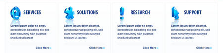

[back](design.md)
# Competences

> :question: The name 'Competences' doesn't feel right. Any suggestions?
 
This pattern is used to illustrate the main competences of the business / project.

## Problem Summary

## Also Known As

## Usage

This pattern is mainly used on the home page, and located just above the fold.

## Required data

This content type takes a list with (recommended: 3 to 4) [Teaser](../structural/teaser.md) elements.

## Examples

