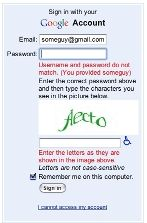
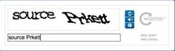

[back](input-control.md)

# Captcha

Captcha is short for 'Completely Automated Public Turing test to tell Computers and Humans Apart'.
The whole idea behind Captchas is to distinguish humans from computers letting the user perform an action a computer can't.
A captcha is a simple Turing test.

## Problem Summary

Websites featuring the ability for visitors to comment, register as a user, or otherwise actively post content on the website 
are often exposed to attacks from spam-robots. 
The content posted by such spam-robots can be compared to spam sent by e-mail. 
The main purpose of spam-robots on the web is to create and spread links to a specific website, 
in order to increase the websites search rating on search engines like google.com. 
These spam-posts rarely have anything to do with the subject of the website, hence the spam categorization.

## Also Known As

## Solution

The most popular form of Captchas are images that represent letters and numbers inside.
The user is prompted to write in a separate form field what the image reads in a separate form field.
To prevent spammers from using OCR software to read the image, the image is manipulated in different ways,
which makes it hard for computers while maintaining readability for humans.

If the user succeeds in typing what the image says, his content is posted to the website.
If not, the action will be refused.
It is common to allow a number of tries to enter the captcha text,
as some captcha images are even unreadable to humans due to the strong image manipulation is has been exposed to.

There is a fine line between making a captcha unrecognizable for OCR scanners and still readable for human beings.
Readability for the human has to come first.
Other problems with implementing captchas to protect your website include a lock-out from visually impaired users,
as they can't use voice software to speak what the captcha reads.

Other forms of protection from malicious spammers are asking questions
like “what is 2 + 3” or “what is two plus three” or using voice captchas,

## Usage

Use a Captcha, when
 
  - your web application experiences attacks from malicious web-robots trying to post spam-content on your site
  - you need to protect your website from automated robots
  - the capability to post content to your website is not blocked by the need to be logged in. Registration processes are included.

## Required data

A Captcha does not need data.
The Captcha is responsible to create or define the challenge.
It provides a validation rule, that checks if the Captcha was resolved correctly.

## Examples

## References

  - Captcha on [ui-patterns.com](http://ui-patterns.com/patterns/Captcha)

