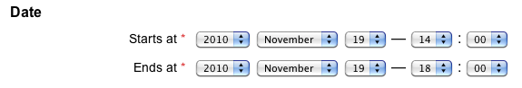

[back](input-control.md)

# Date range

Input control for entering two dates: from and  to date.

## Problem Summary

The user wants to input date range. 

## Also Known As

## Usage

Allow users to input from date and to date.

## Required data

Property | Type | Description
------------ | ------------- | -------------

## Examples

## References

