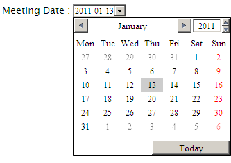
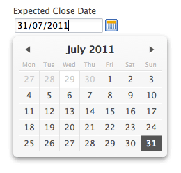
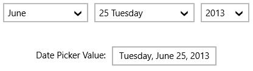
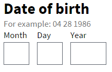
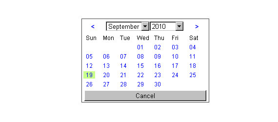
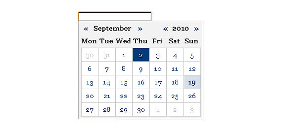
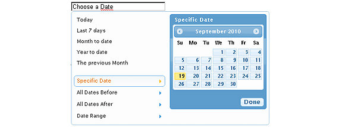
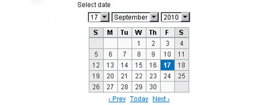

[back](input-control.md)

# Date

Input field for entering date.

## Problem Summary

The user wants to input a date value.

## Also Known As

## Usage

A control for entering a date (year, month, and day, with no time).

## Required data

## Examples

Basic usage

## References

