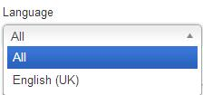

[back](input-control.md)

# Language

Input field for selecting language.

## Problem Summary

The user wants to input language selection. 

## Also Known As

## Usage

Allow users to input language preference. 

## Required data

Property | Type | Description
------------ | ------------- | -------------
ISO Code | string | ISO code for language

## Examples

## References

http://www.loc.gov/standards/iso639-2/

