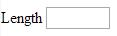

[back](input-control.md)

# Length

Input field for entering decimal numeric value.

## Problem Summary

The user wants to input decimal number for length either in imperial or metric format. 

## Also Known As

## Usage

Allow users to input length value, either in imperial (miles, yards, feet, inches) or metric format, based on location.

## Required data

Property | Type | Description
------------ | ------------- | -------------

## Examples

## References

