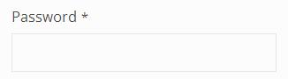

[back](#)
# Password

Input field for entering password

## Problem Summary

The user wants to input a secret value.

## Also Known As

## Usage

Allow users to input secret password. The field does not display the actual characters entered.

## Required data

Property | Description
------------ | -------------
label | The field's label
placeholder | This help text is displayed as placeholder before the actual password is entered

## Examples

## References
