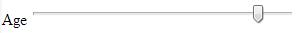

[back](input-control.md)

# Range

A control for entering a number whose exact value is not important.

## Problem Summary

The user wants to select a value interactively without entering number.

## Also Known As

## Usage

This type control uses the following default values if the corresponding attributes are not specified:
min: 0
max: 100
value: min + (max-min)/2, or min if max is less than min
step: 1

## Required data

Property | Type | Description
------------ | ------------- | -------------
min | integer | The starting number for the range
max | integer | The ending number for the range
step | integer | The increment number for the sequence

## Examples

## References

