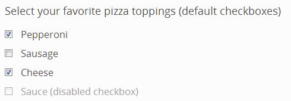
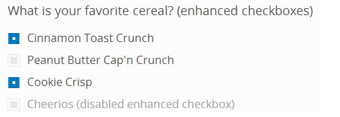

[back](input-control.md)

# Checkbox Select

Input field that can be turned on and off to indicate selection.

## Problem Summary

The user wants to make one or more selection from a group of items.

## Also Known As

## Usage

Allow users to input zero or more selection from a group of selection options. The user can switch the state of the check box by selecting it with the mouse or keyboard.

Use the value attribute to define the value submitted by this item. 
Use the checked attribute to indicate whether this item is selected. 

## Required data

Property | Type | Description
------------ | ------------- | -------------
value | string | The value sent to server on form submission

## Examples

## References

https://developer.mozilla.org/en-US/docs/Web/HTML/Element/input

