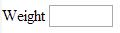

[back](input-control.md)

# Weight

Input field for entering decimal weight value.

## Problem Summary

The user wants to input decimal number for weight either in imperial or metric format. 

## Also Known As

## Usage

Allow users to input weight value, either in imperial or metric format, based on location.

## Required data

Property | Type | Description
------------ | ------------- | -------------

## Examples

## References

