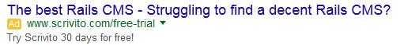

[back](structural.md)
# Advertisement
An external advertisement (banner).

## Problem Summary

The user wants to know whether a particular section is an advertisement.

## Also Known As

## Usage
Allows users to easily identify whether a particular section is an advertisement; either through text description or image naming the section as advertisement.

## Required data

Property | Type | Description
------------ | ------------- | -------------

## Examples
