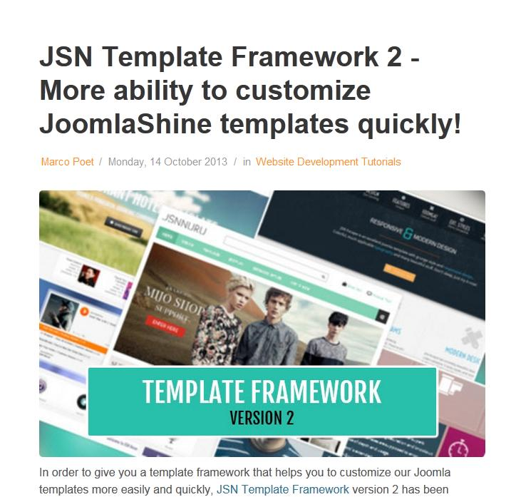

[back](structural.md)
# Article
Container for all elements in an article.

## Problem Summary
The user wants to create an article in a new page.

## Also Known As

## Usage
The user wants to initiate a new article. The article holds as container for other page elements like heading, image, paragraph text content etc.

## Required data

Property | Type | Description
------------ | ------------- | -------------

## Examples

