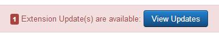

[back](structural.md)
# Call to Action

It is like the Teaser pattern plus a button.

## Problem Summary

The user wants to add call to action button next to other patterns like teaser.

## Also Known As

## Usage
Allows user to add call to action button. This pattern is useful when action is required from user in addition to content displayed in the UI pattern.

## Required data

Property | Type | Description
------------ | ------------- | -------------
Button title | string | The button text 

## Examples

