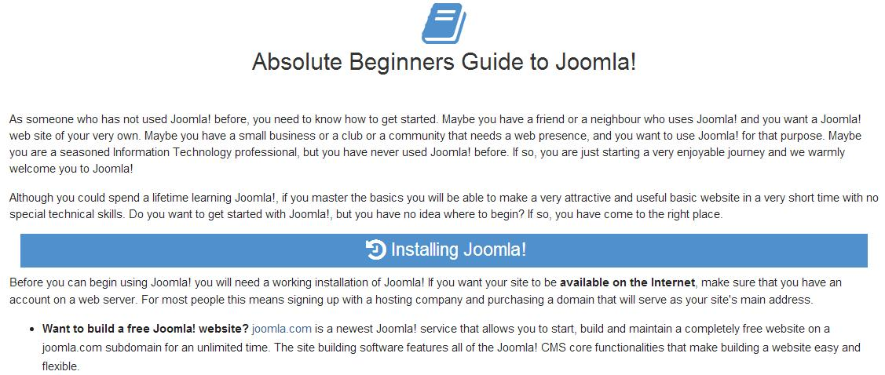

[back](structural.md)
# Chapter
It is a section of a longer text like in a book.

## Problem Summary

The user wants to group several sections of content.

## Also Known As

## Usage
The user wants to initiate a new chapter. The chapter holds as container for other page elements like heading, image, paragraph text content etc.

## Required data

Property | Type | Description
------------ | ------------- | -------------

## Examples

