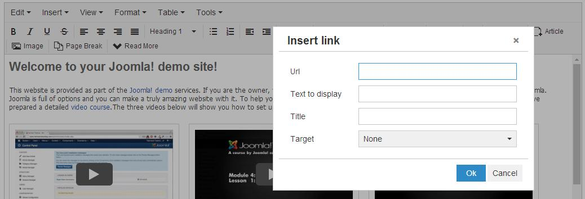

[back](structural.md)
# Link
Allows hyperlink to a location on the same page or any other page on the Web.

## Problem Summary
The user wants to create a link to different part of the page or website.

## Also Known As

## Usage
This allows the user to link content in some other part of the same page or any other page in the web.

## Required data

Property | Type | Description
------------ | ------------- | -------------
url | string | the address of the link target
link text | string | The name for the link

## Examples

