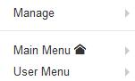

[back](structural.md)
# Menu
Menus allow a user to navigate through the site.

## Problem Summary
The user wants to see all the commands that one can use to perform action or navigate in the site.

## Also Known As

## Usage
A menu is an object which contains one or more menu items. Each menu item points to a logical page on the site. A menu module is required to place the menu on the page.

## Required data

Property | Type | Description
------------ | ------------- | -------------

## Examples

