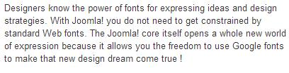

[back](structural.md)
# Paragraph

A paragraph is a distinct section of a piece of writing, usually dealing with a single theme and indicated by a new line, indentation, or numbering.

## Problem Summary

The user wants to construct a paragraph, using a particular font, size etc.  

## Also Known As

## Usage

A well-set paragraph of text is not supposed to wow the reader; the wowing should be left to the idea or observation for which the paragraph is a vehicle.

Following should be considered for paragraph text,
Typeface
Font size and measure
Leading and vertical rhythm
Word spacing and justification

## Required data

Property | Type | Description
------------ | ------------- | -------------
font-family | string | list of font family names and/or generic family names
font-size | number | size of font 
font-style| string | select italic or oblique faces within a font-family
font-weight| string | specifies the weight or boldness of the font
line-height| number | specifies the minimum height of line boxes 
text-indent| number | specifies the amount of indentation  should be left before lines of text in a block

## Examples

