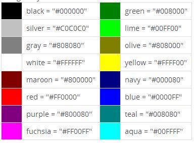

[back](structural.md)
# Table
It represents tabular data: information expressed via two dimensions or more.

## Problem Summary

The user wants to represent data as rows and columns.

## Also Known As

## Usage
The user can table of desired rows and columns. Usually, the first row will be the table header row. 

The user can format the table cells, rows like setting color, border etc.

## Required data

Property | Type | Description
------------ | ------------- | -------------
width | number | the width of table
height | number | the height of table
border | number | the table border
alignment | string | the alignment of cell content

## Examples

