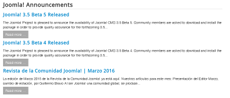
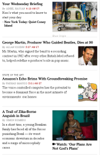

[back](structural.md)
# Teaser

## Problem Summary

A *Teaser* is a short text or picture element to entice the visitor for further reading or clicking.

## Also Known As

## Usage

The *Teaser* is often used on the front page and advertises the actual contribution.
It can be part of other Patterns, as the [*Feature List*](../design/feature-list.md) Pattern.

## Required data

Property | Type | Description
------------ | ------------- | -------------
`image` | Image | The image / icon
`title` | Headline | The title
`body` | Compound | The body (Compound of arbitrary ContentTypes)
`link` | Link | The link to the contribution

## Examples

